# Visual Studio Code 使用Git进行版本控制全攻略

>本来认为此类教程，肯定是满网飞了。今天首次使用VS Code的Git功能，翻遍了
所有中文教程，竟没有一个靠谱的。遂动笔写一篇，造福网友吧。

>* 请确保你安装了最新的VS Code.http://code.visualstudio.com/
>* 请确保安装了最新版的Git。https://git-scm.com/download。git安装到环境变量里，
确保任意路径可以访问。
>* 参考链接：https://code.visualstudio.com/Docs/editor/versioncontrol

VS Code 集成了Git功能，并支持基本的git命令，这使得我们能够在开发过程方便的提交和获取代码。

## 1.1 初始化

首先我们创建一个名为gittest的文件夹，当然它不在git的版本控制管理中。

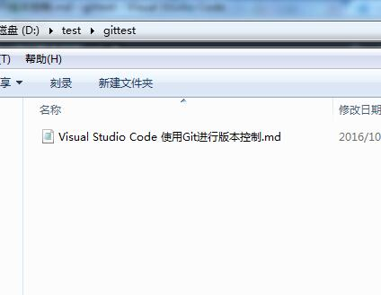

用VS Code 打开这个文件夹，单击左侧的git图标。

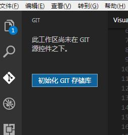

我们可以看到“初始化GIT存储库”的按钮，单击。

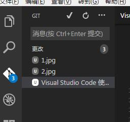
初始化之后，我们首先看到的是git栏里显示了当前所有文件，有4个更改。

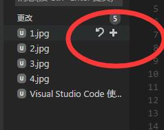

全部或者单个文件都可以选择暂存或者清理掉。

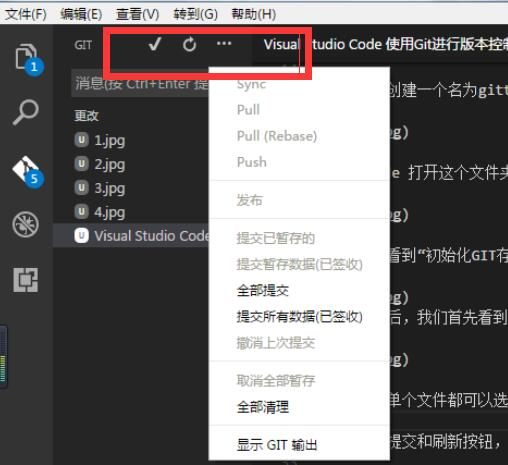

在上方有提交和刷新按钮，下拉菜单里有更多选项。
再回到我们的文件中，刚才的操作创建了一个.git文件夹，放置了当前仓库的所有
配置文件，如下图。

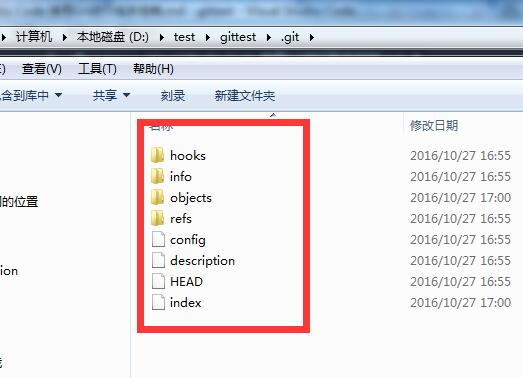

到目前为止我们在本地创建了一个代码仓库，下面来看一下VS Code的git功能。

## git 输出

我们可以在隐藏的菜单中选择git输出，这样我们每个操作都会显示
在输出区域，方便我们查看对应的git命令。

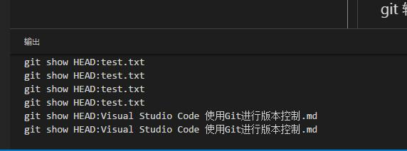

## 提交保存

提交保存的第一步是暂存文件。

第二步是输入提交信息。

第三步然后使用状态栏的提交按钮提交全部更改。

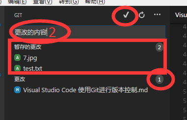

## git命令列表

ctrl+shift+P，输入git，会看到VS CODE支持的所有git命令。

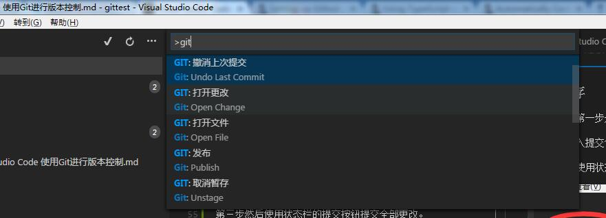

### 撤销操作

输入 Undo Last Commit，撤销上次操作。输入Unstage,撤销暂存。

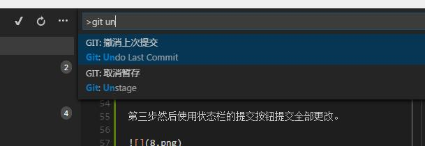

### 分支

输入Branch可以创建当前内容的分支。创建分支时需要输入分支名称。

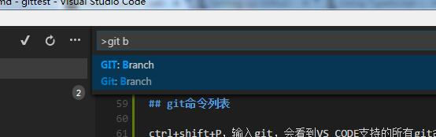
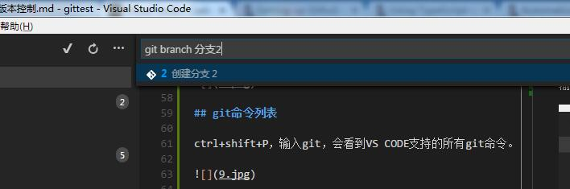

### checkout

创建分支后，使用checkout命令可以拉取特定的分支内容。

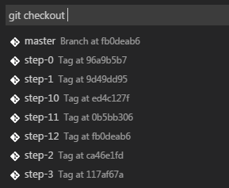

### 冲突合并

VS Code 会检测文件冲突，并以<<<<<,>>>>,====和颜色区分出来。


解决冲突之后，直接提交就行了。

### 文件比较

在git文件列表中，单击一个未提交更改的文件，就会打开两个窗口来显示变更的内容。

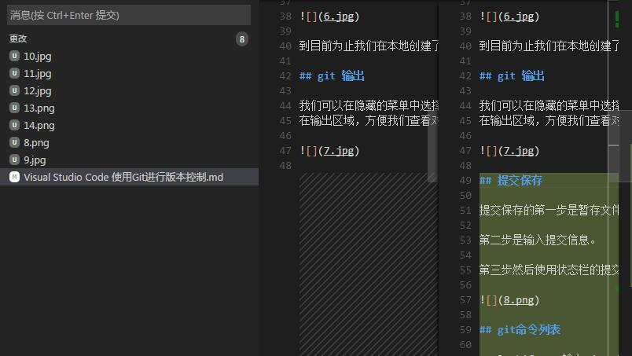

## 连接远程代码仓库

说了这么多，现在问题来了，在本机初始化一个代码库，一般没什么卵用。
我们大多数情况是要连接远程的代码服务器的。

下面我们在github上创建一个Repository，复制地址备用。

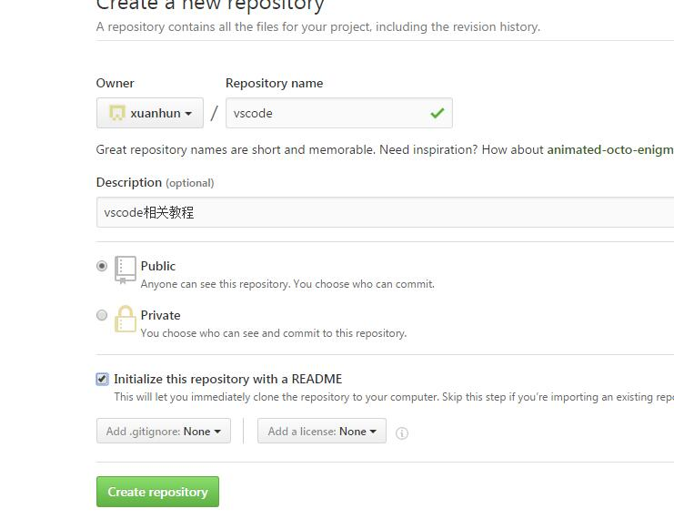
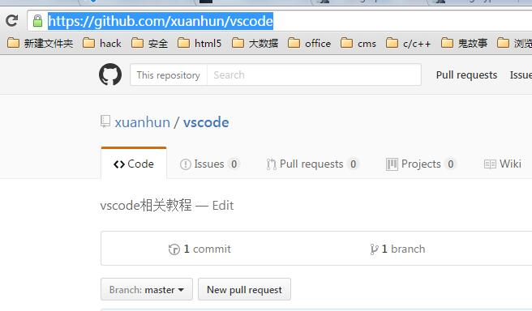

接下来到当前Repository文件夹根目录中，如果没有初始化过，安装文章开始初始化的方法，进行初始化。
然后执行下面的命令

``` shell
git remote add origin https://github.com/xuanhun/vscode.git
```

现在我们查看一下.git文件夹下的config文件，可以看到添加了远程Reps地址。

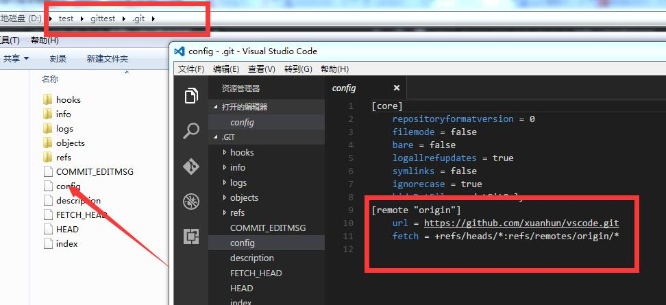

